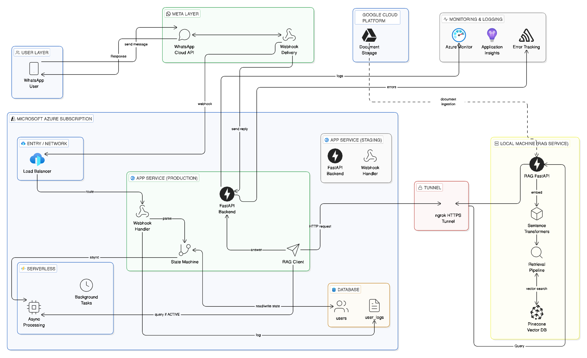

<div align="center">


# CHAR.AI

**Event-driven WhatsApp AI — RAG pipeline, real-time inference, production deployment**

<br/>

[](https://fastapi.tiangolo.com)
[](https://pinecone.io)
[](https://openai.com)
[](https://developers.facebook.com/docs/whatsapp)
[](https://azure.microsoft.com)
[](https://postgresql.org)

</div>

---

## System Architecture

<div align="center">
  
</div>

---

## Request Flow

```
WhatsApp User
     │
     ▼
Meta Cloud API  ──  Webhook delivery (HTTP POST)
     │
     ▼
Azure Load Balancer
     │
     ▼
FastAPI Backend  ──  HMAC validation · event filtering · session routing
     │
     ├──  PostgreSQL  ──  session state (atomic transitions, optimistic locking)
     │
     ▼
RAG Client  ──  HTTP over ngrok HTTPS tunnel
     │
     ▼
RAG Microservice
     ├──  Sentence Transformers  ──  768-dim dense embedding
     ├──  Pinecone ANN search    ──  cosine similarity, top-K retrieval
     ├──  Context assembly       ──  chunk ranking · prompt construction
     └──  OpenAI GPT-4           ──  grounded generation (temp 0.2)
     │
     ▼
WhatsApp API  ──  response delivery
```

---

## Pipeline

### Webhook ingestion
Validates HMAC signature, extracts `sender_id` + `message.body`, discards non-message events (delivery receipts, read acks, status updates).

### Session engine
Finite-state machine persisted in PostgreSQL. Atomic state transitions with optimistic locking. Background workers handle session expiry and retry queuing off the critical path.

### RAG inference
| Stage | Detail |
|---|---|
| Embedding | `sentence-transformers/all-mpnet-base-v2` → 768-dim vector |
| Retrieval | Pinecone cosine ANN → top-K chunks + relevance scores |
| Context assembly | Score-ranked chunks truncated to LLM context window |
| Generation | OpenAI Chat Completions · temp `0.2` · grounded prompt |

### Observability
Azure Monitor + Application Insights — distributed traces across webhook handler, state machine, RAG client. Error-level alerts on all service boundaries.

---

## Data Ingestion

```
POST /admin/ingest

/data  →  parse  →  chunk (512 tok, 64 overlap)  →  embed  →  Pinecone upsert
```

Each chunk upserted with metadata envelope: `{ source, page, timestamp }` — enables citation-level traceability in retrieval.

---

## Tech Stack

| | |
|---|---|
| API | FastAPI |
| Session DB | PostgreSQL |
| Vector DB | Pinecone |
| Embeddings | Sentence Transformers |
| LLM | OpenAI GPT-4 |
| Messaging | WhatsApp Cloud API |
| Cloud | Microsoft Azure (App Service · Monitor · Application Insights) |
| Tunnel | ngrok HTTPS |
| Doc storage | Google Cloud Platform |

---

## Status

| | |
|---|---|
| Webhook integration | ✅ |
| Session state machine | ✅ |
| RAG inference pipeline | ✅ |
| Data ingestion pipeline | ✅ |
| Async worker pool | ✅ |
| Observability | ✅ |
| End-to-end | ✅ |
